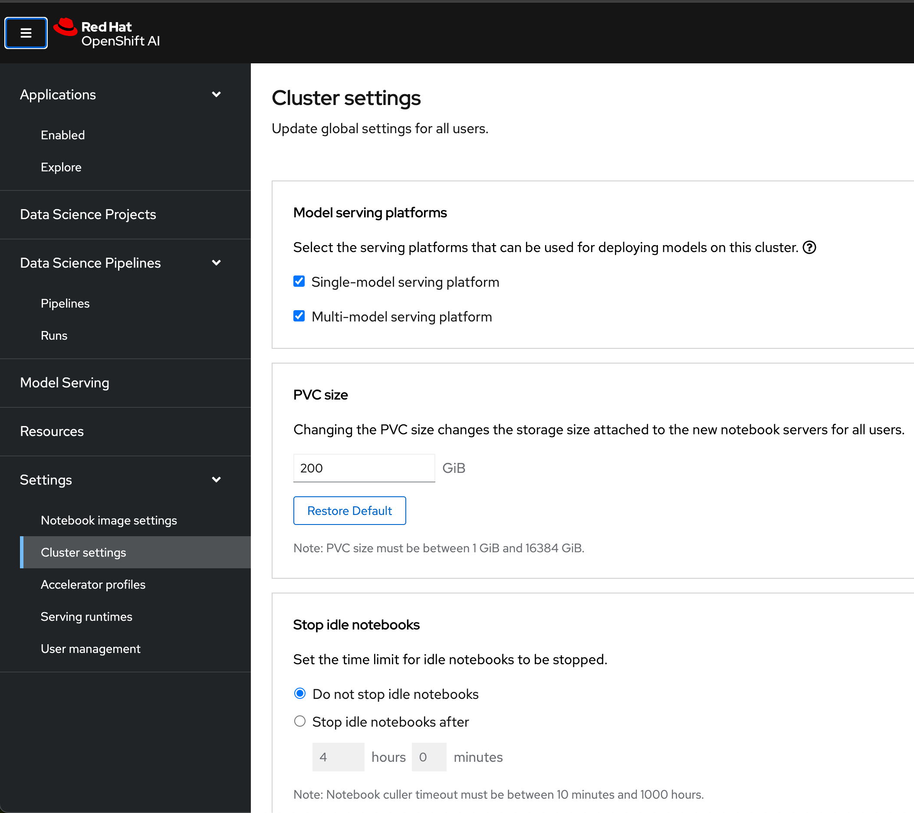
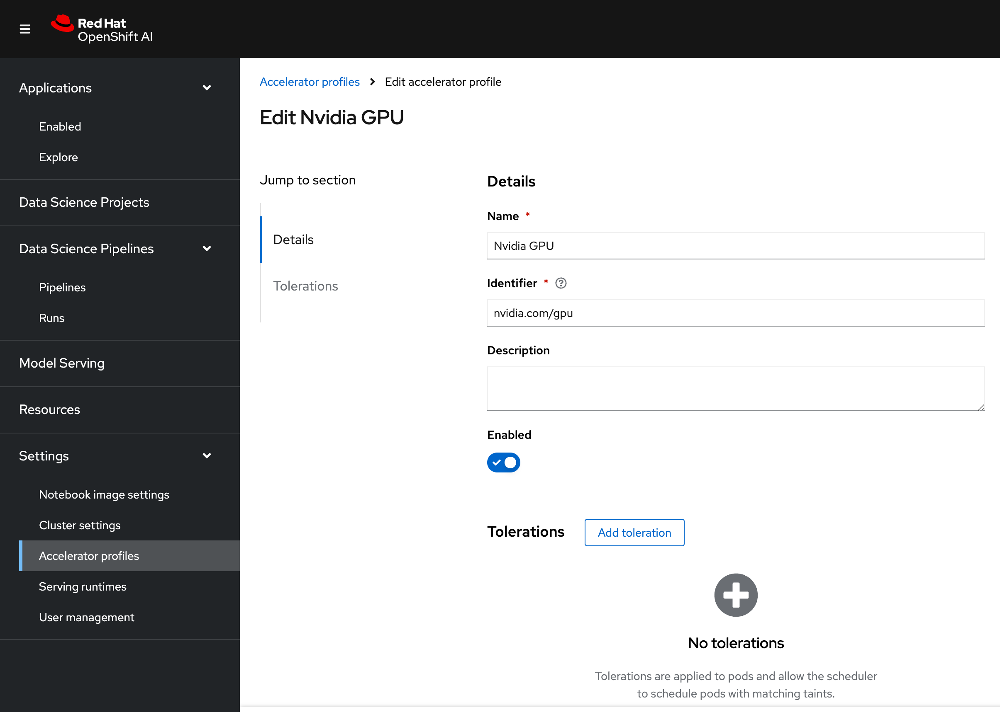
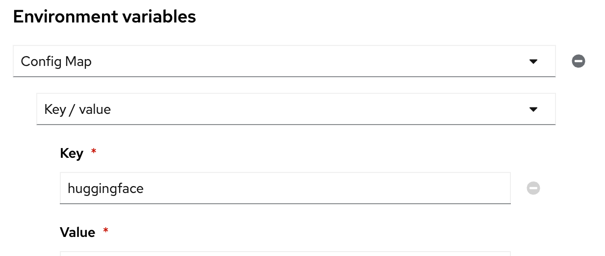
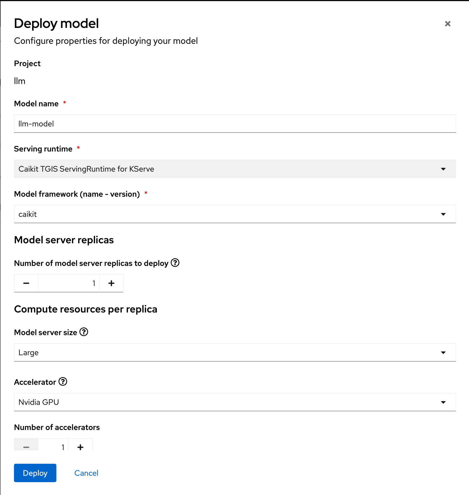
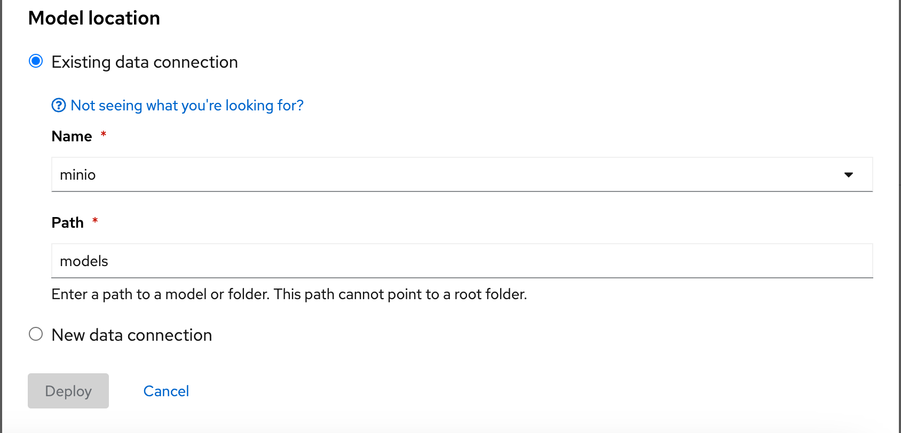
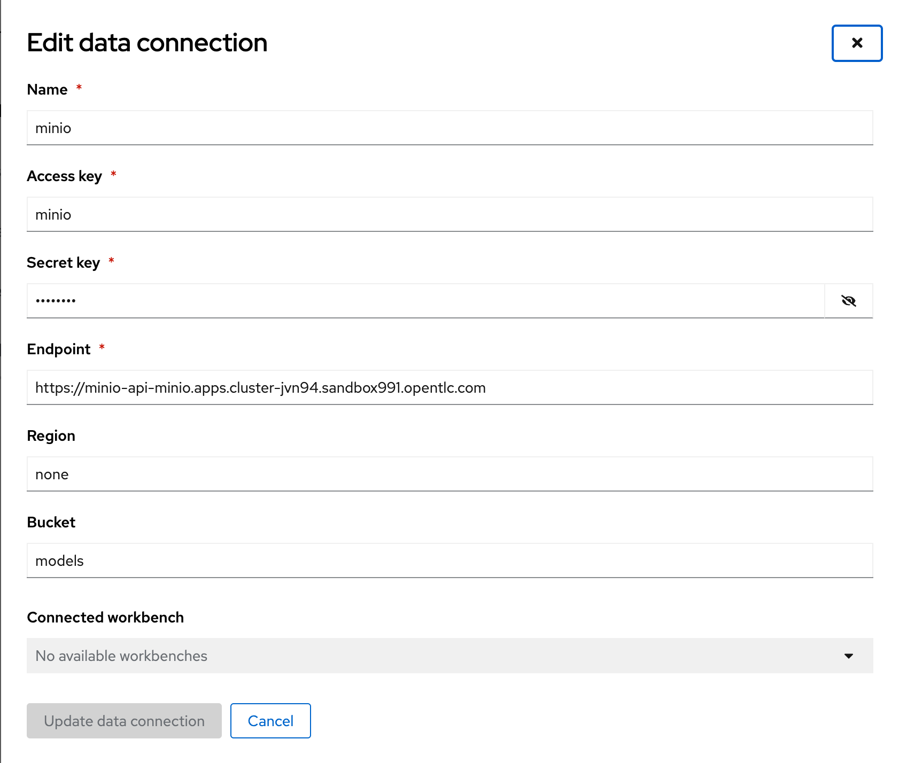
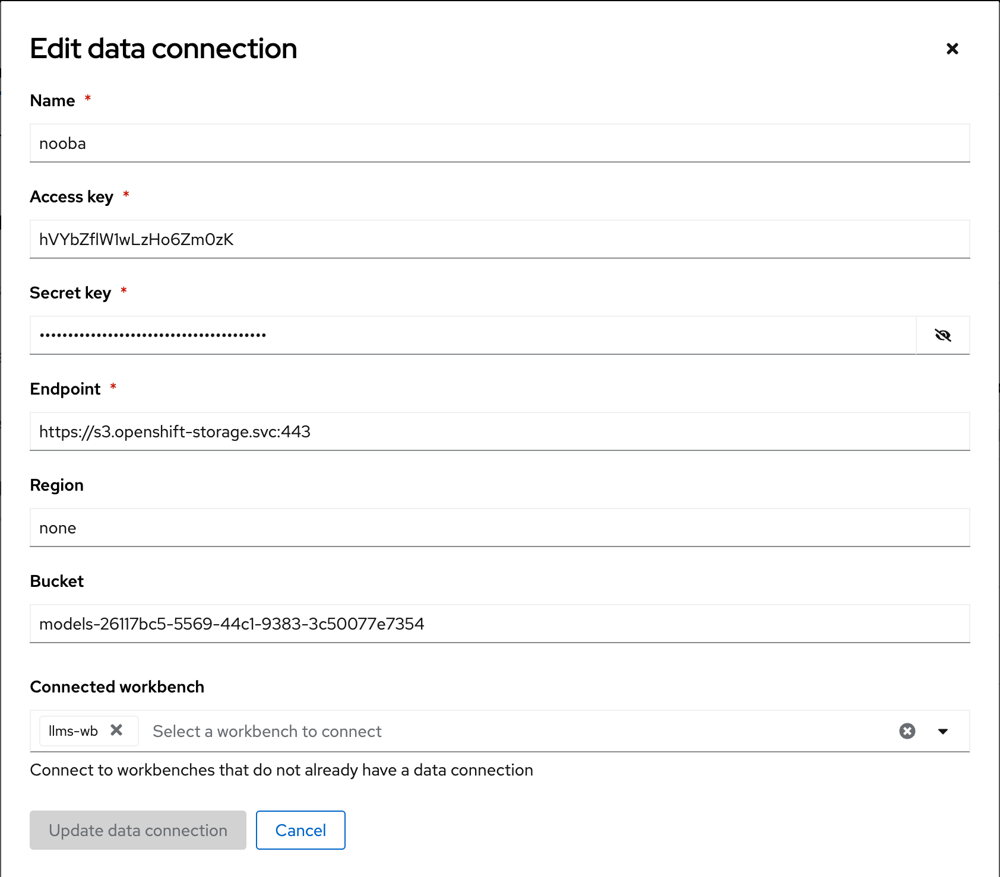

# Settings
1. Change default PVC size to 200 Gb and save 
   1. 
2. Create Accelerators profiles 
   1. oc apply -f https://raw.githubusercontent.com/arslankhanali/openshift-helper/main/crds/ai_acceleratorprofile.yaml
   2. 
3. Choose single model serving platform in cluster settings
   

### Work bench
1. Env variable
   1. Setup hugging face
      1. 
   2. cluster token and server endpoint

### Model Deploy
1. Noobaa gave SSL error
   1. bucket created with storageclass openshift-storage.noobaa.io that comes with ODF..I just had to use http svc endpoint instead of https to not bother with SSL. https://redhat-internal.slack.com/archives/C03UGJY6Z1A/p1707429323427249?thread_ts=1707385261.181629&cid=C03UGJY6Z1A 
2. Minio gave model not found error
   1. 
   2. 
3. minio/aws can read file with models/XXX
   ODF can not read files with models/XXX
   ODF can read files with /models/XXX

### Data connection
1. For minio use minio-api url not minio-ui
   1. 
2. By default it has 100gb space
3. Noobaa
   1. 

# Ray
1. Run 1_create_ray.ipynb to create a ray cluster and submit a llmfinetune python script to run
   1. Give hugging face token. Get from https://huggingface.co/settings/tokens
   2. Give openshift cluster token and server. Can get from https://oauth-openshift.apps.cluster-jvn94.sandbox991.opentlc.com/oauth/token/display
2. Run 2_inferdemo.ipynb to infer the demo that you pushed to hugging face
   1. Change huggingface address from 'arslankhan' to your url name

### Questions
1. Model not found
  1. minio/models/Mistral-7B-Instruct-v0.2-caikit
2. convert.py is generic ?
  1. Is it only for llms ?
     1. `Yes`
  2. can it be used for tf, pt formats
     1. `No , can only to pytorch`
3. Ray cluster
  1. pods were running but it was inactive when workers were 2
     1. `llmfinetune.py has only 1 cuda. change that. make sure workers have enough GPUs available`
  2. when was requirmnets.txt run ?
     1. `See DDPJobDefinition in 1_`
  3. will it run any python file ?
     1. `yes`
  4. will it lock GPU ? Can other use gpu at the same time?
     1. `GPU is locked`
  5. can it slice gpu ?
     1. `yes, A100s`
  6. how to know its gpu or cpu ?
     1. `See llmfinetune.py and find device_map`
  7. Where can I specify space - I got no space error when running your llama2 notebook
     1. `min_memory=96, max_memory=96, in 1_`
     2. Detected kernel version 4.18.0, which is below the recommended minimum of 5.5.0; this can cause the process to hang. It is recommended to upgrade the kernel to the minimum version or higher.71[2m[36m(CommandActor pid=297, ip=10.128.4.35)[0m [1]:Traceback (most recent call last):
     3. ValueError: You can't train a model that has been loaded in 8-bit precision on a different device than the one you're training on. Make sure you loaded the model on the correct device using for example `device_map={'':torch.cuda.current_device() or device_map={'':torch.xpu.current_device()}
     4. Error Type: TASK_EXECUTION_EXCEPTION

ray::CommandActor.exec_module() (pid=297, ip=10.128.4.35, actor_id=732d1b64dea91230dc72275a02000000, repr=<ray_driver.CommandActor object at 0x7f94038faa00>)
 File "/tmp/ray/session_2024-03-10_00-26-23_834207_8/runtime_resources/working_dir_files/_ray_pkg_51de4185a0c914d6/ray_driver.py", line 93, in exec_module
   raise RuntimeError(f"exec_module failed with return code {returncode}")
RuntimeError: exec_module failed with return code 1

4. Do you need https://github.com/avijra/rhods-finetunning-demo oc apply ?
  1. Should not be it automatic?
  2. `not needed, only useful for rag demo`